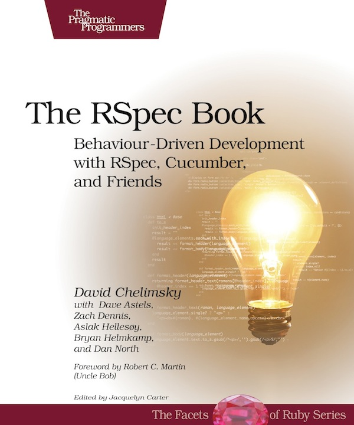

!SLIDE
# BDD #

## Behavior Driven Development ##
### Felipe Kaufmann ###

!SLIDE bullets incremental
# So what is BDD? (1/2)#

* an agile software development technique
* aims to bring developers and non-technical stakeholders closer together

!SLIDE bullets incremental
# So what is BDD? (2/2)#

* originally coined in 2003 by Dan North (JBEhave)
* evolved from an extension of TDD (TDD done well) to much more
* critics still say it's just a fancy word for TDD

!SLIDE center

!SLIDE bullets incremental
# The Rpec Book says... 

* Behavior Driven Development is about implementing an application by
  describing its behavior from the perspective of its stakeholders

* **writing software that matters**

!SLIDE bullets incremental
# BDD Principles

* Enough is enough (don't plan to much ahead)
* Up-front analysis, design and planning all have a diminishing return

!SLIDE bullets incremental
# BDD Principles

* Deliver stakeholder value (don't do it if it does not add value)
* Any system should have an identified, verifiable value to the business

!SLIDE bullets incremental
# BDD Principles

* It's all behavior (everything can be described in behavior)
* Business and Technology should refer to the same system in the same way
