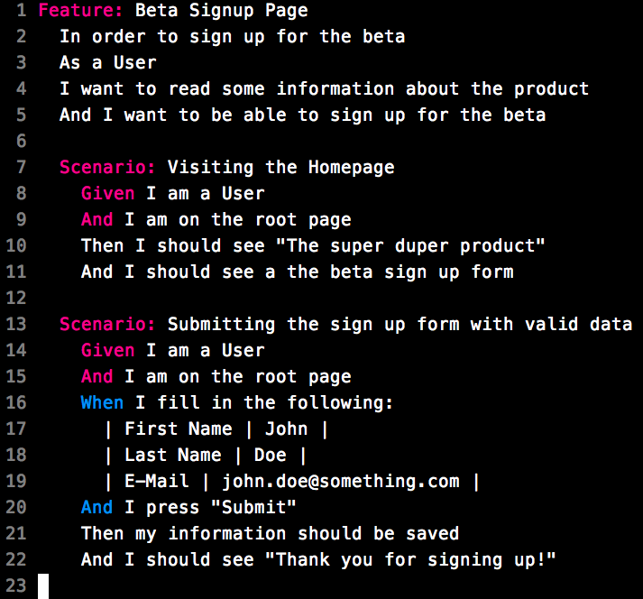
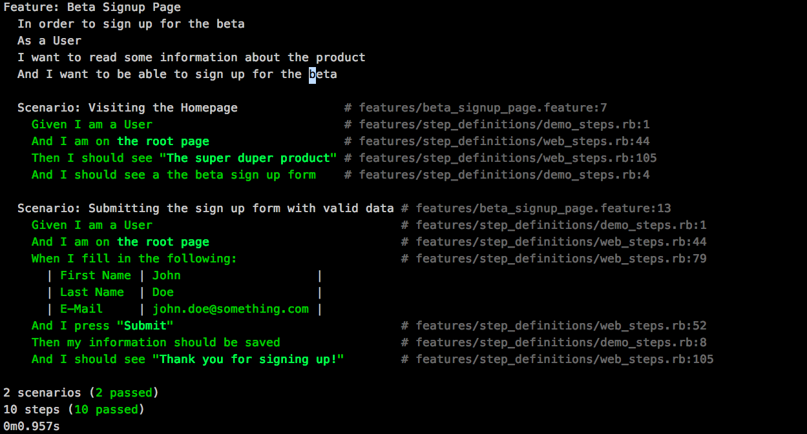
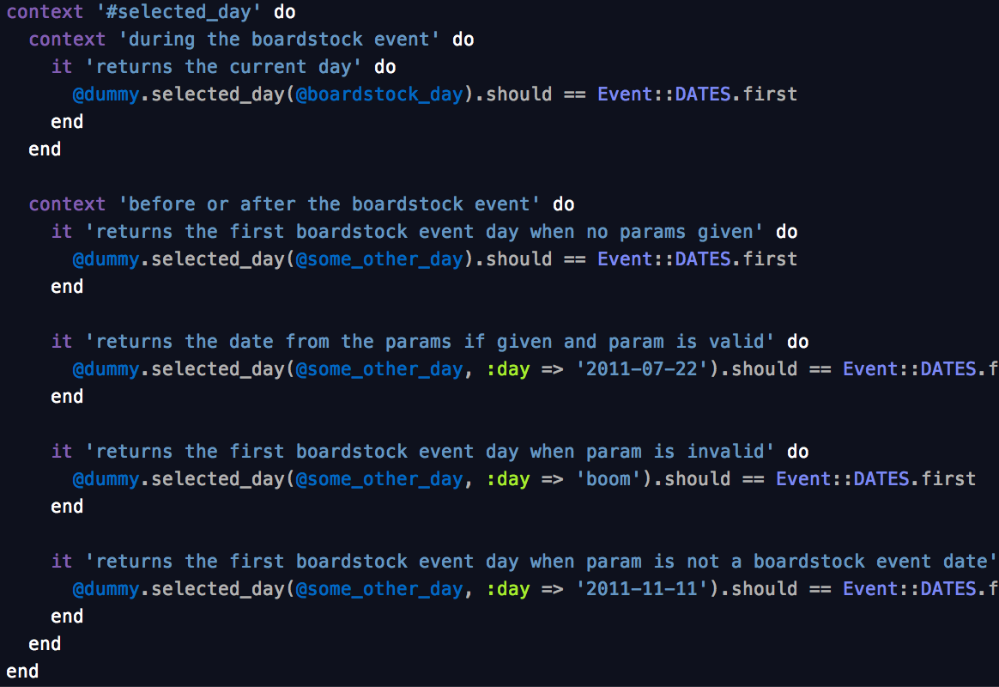
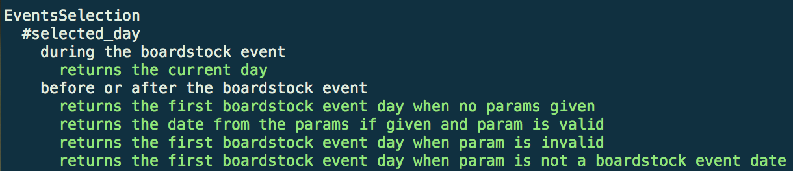
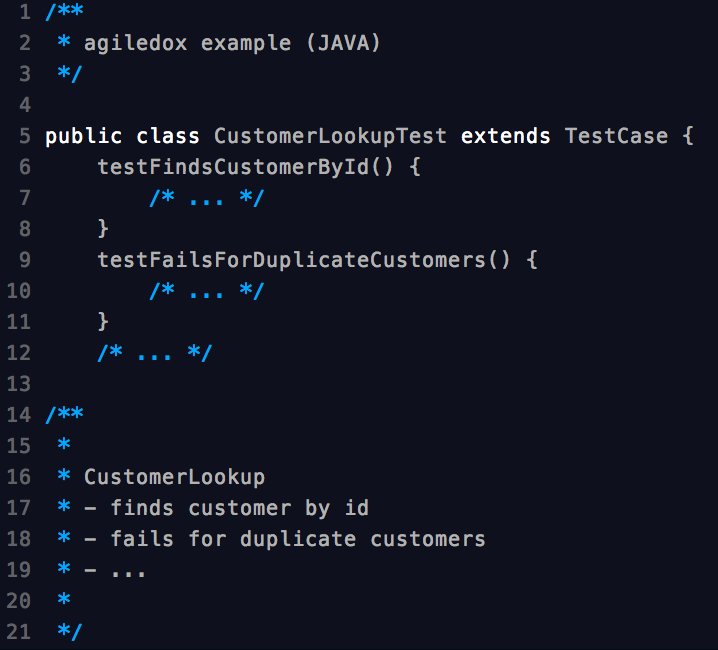
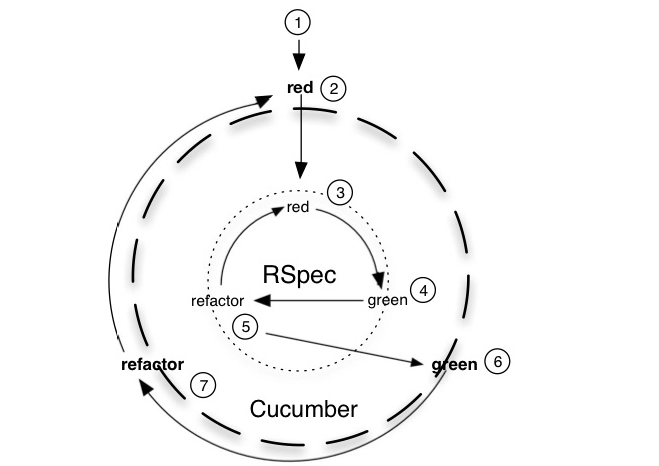
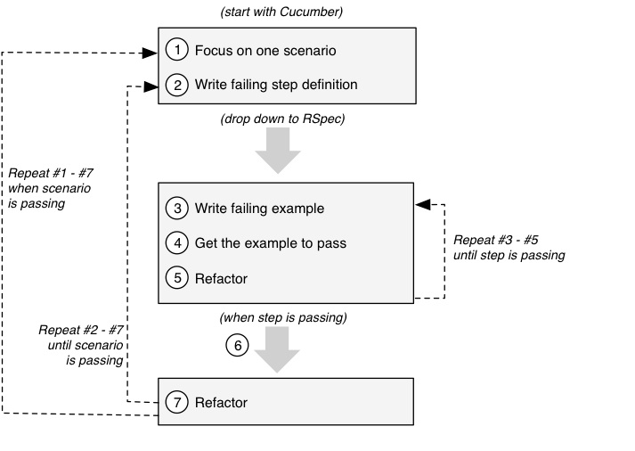

!SLIDE bullets incremental
# inspect and adapt (1/2)
## better TDD

* tests that work on a higher level and correspond to acceptance
  criterias of a user story

* tests (or test output) that are understandable by non-technical stakeholders

!SLIDE bullets incremental
# Pick your tool

* Cucumber (Ruby, Java)
* RSpec (Ruby)
* Concordion (Java)
* JBehave (Java)
* EasyB (Java)
* ...

!SLIDE center
# Cucumber: The Holy Grail of BDD ?

!SLIDE center
## Cucumber Example Input

!SLIDE center
## Cucumber Example Output

!SLIDE center
## RSpec Example Input 

!SLIDE center
## RSpec Example Output 

!SLIDE center
## agiledox example

!SLIDE bullets incremental
# inspect and adapt (2/2)
## clear workflow

* from a business requirement/vision
* to features & user stories
* to acceptance tests and unit tests
* that drives the actual code implementation

!SLIDE bullets incremental
# BDD Workflow: Planning
## Priorization
* establish next best "vision" that will deliver value to the business
* Example: we need potential users for our beta launch

!SLIDE bullets incremental
# BDD Workflow: Planning
## Establish what is needed to achieve the vision

* Product owner wants to inform potential users about the product
* The users want to sign up for the beta if they are interested in the product
* The developer who will have to work with the user data wants that only
  valid emails get trough the signup process

!SLIDE bullets incremental
# BDD Workflow: Planning
## Formalize the requirements with scenarios and examples

!SLIDE bullets incremental
# BDD Cycle

* outside in development workflow
* run tests all the time, automatically, while coding

!SLIDE center 
# BDD Cycle

!SLIDE center 
# BDD Cycle

!SLIDE bullets incremental
# The added value of BDD (1/2)
* acceptance criterias of a user story can be formalized
* one clear definition of what is necessary for the user story to be
  complete
* automated testing of acceptance criteria

!SLIDE bullets incremental
# The added value of BDD (2/2)
* traceability of any code back to a specific stakeholders need
* clear path for developer on TDD/BDD best-practices and workflow
