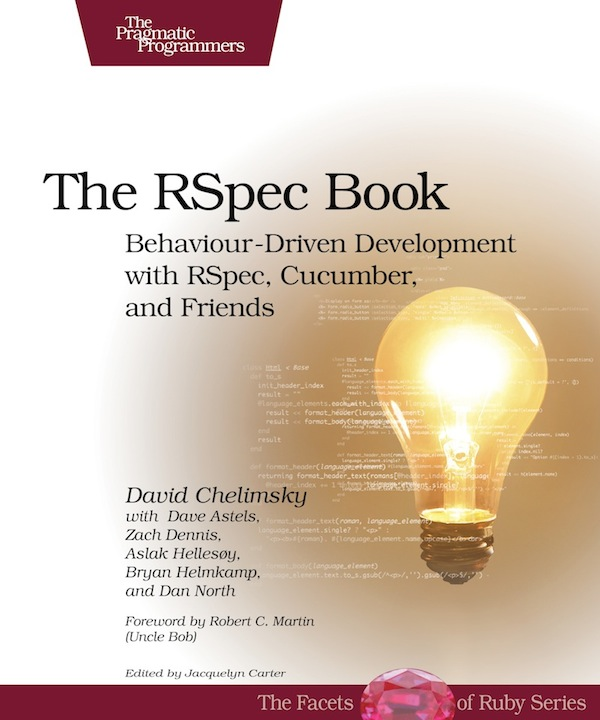

!SLIDE
# BDD #

## Behavior Driven Development ##
### Felipe Kaufmann ###

!SLIDE bullets incremental
# So what is BDD? (1/2)#

* an agile software development technique
* second generation of TDD
* aims to bring developers and non-technical stakeholders closer together

!SLIDE bullets incremental
# So what is BDD? (2/2)#

* originally coined in 2003 by Dan North (JBEhave)
* evolved from an extension of TDD (TDD done well)
* critics still say it's just a fancy word for TDD
* **no canonical definition!**

!SLIDE full-page
<!-- -->

